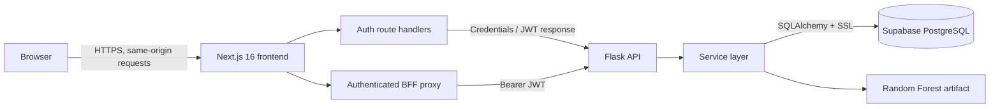

# RFS — Restaurant Forecasting System

RFS is a full-stack decision-support application for small independent restaurants. It combines booking management, operational dashboards, short-term reservation forecasting, staffing recommendations, and labour-cost estimates in a single protected interface.

The project was developed by Valerio Gerardi as a BSc (Hons) Computing dissertation at Southampton Solent University.

## Features

- Secure manager authentication and protected dashboard routes
- Dashboard summaries, recent bookings, and weekly demand views
- Booking creation, editing, and deletion
- Seven-day reservation-demand forecasts
- Demand-based staffing recommendations and labour-cost forecasts
- Database-managed staffing rules, roles, hourly rates, and shift lengths
- Random Forest model training and recursive forecast generation
- Backend and database health checks

## Architecture

RFS is split into independently deployable frontend and backend services. The browser communicates only with the Next.js application. Next.js acts as a Backend for Frontend (BFF), keeps the JWT out of browser JavaScript, and forwards authenticated requests to Flask.



### Request and authentication flow

1. The browser posts credentials to the same-origin `POST /api/auth/login` Next.js route.
2. The route handler forwards the credentials to Flask at `POST /api/auth/login`.
3. Flask validates the user against PostgreSQL and returns an eight-hour JWT.
4. Next.js stores the JWT in the `rfs_session` HttpOnly cookie. The token is never returned to browser JavaScript.
5. Protected frontend requests use the same-origin `/api/backend/[...path]` proxy.
6. The proxy reads the cookie, adds `Authorization: Bearer <token>`, and forwards the request to Flask with caching disabled.
7. Flask middleware verifies the JWT before protected blueprints invoke controllers and services.
8. Services query PostgreSQL or execute the forecasting pipeline, and the response returns through the proxy.

State-changing proxy requests (`POST`, `PUT`, `PATCH`, and `DELETE`) reject a mismatched `Origin` header. A `401` response from Flask clears the session cookie.

### Backend layers

The Flask application follows a route → controller → service architecture:

| Layer | Responsibility |
| --- | --- |
| `app/api` | Blueprint definitions and URL routing |
| `app/controllers` | Request parsing and HTTP response handling |
| `app/services` | Business rules, database operations, and forecast orchestration |
| `app/db` | SQLAlchemy engine and session configuration |
| `app/middleware` | JWT authentication for protected blueprints |
| `app/ml` | Model training, prediction pipelines, and the serialized model artifact |

## Technology stack

| Layer | Technology |
| --- | --- |
| Frontend | Next.js 16, React 19, JavaScript, CSS |
| Frontend API layer | Next.js App Router route handlers |
| Backend | Python, Flask, Flask-CORS |
| Authentication | JWT, HttpOnly cookies, Werkzeug password hashing |
| Database | Supabase PostgreSQL |
| Data access | SQLAlchemy, psycopg2, SSL, Supabase transaction pooler |
| Machine learning | pandas, NumPy, scikit-learn, joblib, holidays |
| Forecasting model | Random Forest Regressor |
| Hosting | Separate Vercel frontend and backend projects |

## Repository structure

```text
Dissertation/
├── backend/
│   ├── app/
│   │   ├── api/                 # Flask blueprints and routes
│   │   ├── controllers/         # Request and response handling
│   │   ├── db/                  # PostgreSQL connection configuration
│   │   ├── middleware/          # JWT protection
│   │   ├── ml/                  # Training, prediction, and model artifact
│   │   └── services/            # Business and data-access logic
│   ├── main.py                  # Deployment entry point
│   ├── requirements.txt
│   └── run.py                   # Local development entry point
├── frontend/
│   ├── public/
│   ├── src/
│   │   ├── app/                 # Pages and Next.js route handlers
│   │   ├── components/          # Auth, dashboard, chart, table, and layout UI
│   │   ├── hooks/
│   │   ├── lib/api.js           # Same-origin API base
│   │   └── utils/
│   ├── next.config.mjs
│   └── package.json
├── Additional Documentation/   # Research, diagrams, datasets, and evidence
├── package.json                 # Combined Windows development scripts
└── README.md
```

## Local development

### Prerequisites

- Node.js and npm
- Python 3
- A PostgreSQL database containing the project schema and data

### 1. Install dependencies

From the repository root:

```bash
npm install
cd frontend
npm install
cd ../backend
python -m venv venv
```

Activate the Python environment on Windows:

```powershell
venv\Scripts\Activate.ps1
```

Or on macOS/Linux:

```bash
source venv/bin/activate
```

Then install the backend dependencies:

```bash
pip install -r requirements.txt
```

### 2. Configure the backend

Create `backend/.env`:

```dotenv
SECRET_KEY=replace-with-a-long-random-secret
FRONTEND_URL=http://localhost:3000

POSTGRES_USER=postgres.your-project-reference
POSTGRES_PASSWORD=replace-with-your-database-password
POSTGRES_HOST=your-pooler-host.supabase.com
POSTGRES_PORT=6543
POSTGRES_DATABASE=postgres
```

Instead of the separate `POSTGRES_*` values, the backend can use `POSTGRES_URL` or `DATABASE_URL`. PostgreSQL connections require SSL.

### 3. Configure the frontend

Create `frontend/.env.local`:

```dotenv
BACKEND_API_URL=http://127.0.0.1:5000/api
```

`BACKEND_API_URL` is server-only and must not use the `NEXT_PUBLIC_` prefix.

### 4. Run the services

On Windows, the root development script starts both services and expects the virtual environment at `backend/venv`:

```powershell
npm run dev
```

On macOS/Linux, start the services separately:

```bash
# Terminal 1
cd backend
source venv/bin/activate
python run.py

# Terminal 2
cd frontend
npm run dev
```

| Service | Local URL |
| --- | --- |
| Next.js frontend | `http://localhost:3000` |
| Flask API | `http://127.0.0.1:5000/api` |

## API overview

Authentication and health endpoints are public. Demand, dashboard, booking, staff-cost, and staffing-rules blueprints require a valid bearer token. Browser clients reach protected endpoints through `/api/backend/...`.

### Public Flask endpoints

| Method | Endpoint | Purpose |
| --- | --- | --- |
| `POST` | `/api/auth/login` | Authenticate a user and issue a JWT |
| `POST` | `/api/auth/logout` | Acknowledge logout |
| `GET` | `/api/auth/me` | Validate a JWT and return the current user |
| `GET` | `/api/health/` | Check backend availability |
| `GET` | `/api/health/database` | Check database connectivity |

### Protected Flask endpoints

| Group | Example endpoints | Purpose |
| --- | --- | --- |
| Dashboard | `GET /api/dashboard/` | Return dashboard metrics |
| Demand | `GET /api/demand/`, `POST /api/demand/` | Retrieve or create demand records |
| Demand forecast | `GET /api/demand/forecast` | Generate a short-term forecast |
| Demand history | `GET /api/demand/weekly`, `GET/DELETE /api/demand/date/<date>` | Retrieve weekly or date-specific demand |
| Model training | `GET /api/demand/train` | Retrain the Random Forest model |
| Bookings | `GET /api/booking/`, `POST /api/booking/add` | List or create bookings |
| Booking record | `GET/PUT/DELETE /api/booking/<booking_id>` | Manage one booking |
| Staff cost | `GET /api/staff-cost/`, `GET /api/staff-cost/forecast` | Retrieve or generate labour-cost forecasts |
| Staffing rules | `GET /api/staffing-rules/` | Retrieve staffing rules |

## Forecasting pipeline

The model uses records from `restaurant_demand_features`, including same-day, walk-in, advance, total, and duration-adjusted covers. Training creates calendar, lag, rolling-average, weekend, UK bank-holiday, and festive-period features.

Prediction uses up to 90 days of history and requires at least 30 valid records. It generates forecasts recursively: each predicted total becomes part of the rolling history used for the next day. Mondays and the configured Christmas shutdown period are returned as closed days with zero predicted covers.

Model evaluation uses:

- Mean Absolute Error (MAE)
- Root Mean Squared Error (RMSE)
- R²
- Chronological validation

Staffing forecasts combine predicted demand with database-managed staffing rules, roles, hourly rates, and standard shift lengths.

## Deployment

Deploy `frontend` and `backend` as separate Vercel projects.

### Frontend project

- Root directory: `frontend`
- Build command: `npm run build`
- Server-only environment variable:

```dotenv
BACKEND_API_URL=https://your-backend-deployment.vercel.app/api
```

### Backend project

Use `backend/main.py` as the Flask entry point and configure:

```dotenv
SECRET_KEY=replace-with-a-long-random-secret
FRONTEND_URL=https://your-frontend-deployment.vercel.app
```

Also configure either the separate `POSTGRES_*` variables shown above or a complete `POSTGRES_URL`/`DATABASE_URL` connection string. Never commit credentials or local environment files.

## Security design

- HS256 JWTs expire after eight hours.
- Tokens are stored in HttpOnly cookies rather than local storage.
- Production cookies use `Secure` and `SameSite=Lax`.
- The Flask API URL and bearer token remain server-side.
- Protected Flask blueprints require valid JWTs.
- The Next.js proxy checks the origin of state-changing requests.
- Flask CORS permits localhost and the configured frontend origin.
- PostgreSQL connections require SSL and use a fresh connection through `NullPool`.
- Authenticated requests and responses use `no-store` cache policies.
- Flask adds Content Security Policy, `X-Content-Type-Options`, `X-Frame-Options`, and `Referrer-Policy` headers.

## Current limitations

- RFS is an academic prototype, not a commercial restaurant-management platform.
- Forecast accuracy depends on the size and representativeness of the available dataset.
- Serverless backend execution can introduce cold starts.
- Model retraining is exposed through an API route rather than a scheduled production pipeline.
- The configured Christmas closure dates are currently fixed in the prediction pipeline.
- Commercial use would require broader validation with live data from multiple restaurants.

## Author

Valerio Gerardi<br>
BSc (Hons) Computing — First Class Honours<br>
Southampton Solent University
